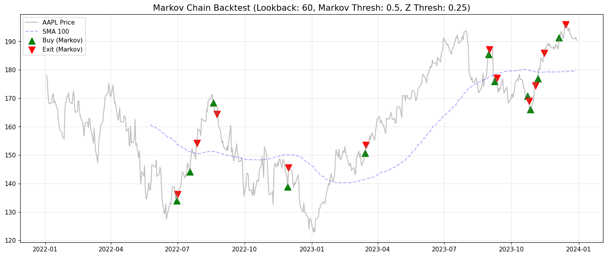

# 📈 Markov Chain Quant Backtester

[](https://markov-quant-backtester-nyhvappehrrrwqpgupw4hsl.streamlit.app/)

An event-driven backtesting engine for equities, built around a **pure statistical trading
strategy**: a Markov chain over volatility-adjusted (Z-score) market states, with no lagging
trend indicators. It ships with an interactive **Streamlit** dashboard for manual backtests and
automated grid-search optimisation.

**🔗 Live demo:** <https://markov-quant-backtester-nyhvappehrrrwqpgupw4hsl.streamlit.app/>

> ⚠️ **Disclaimer:** This is an educational / portfolio project. It is **not** financial advice
> and is not intended for live trading.



---

## 📊 Results & Validation

Backtested on **AAPL daily data (2022–2023)** with the default parameters, and benchmarked against
simply buying and holding the asset over the same window:

| Metric | Strategy | Buy & Hold |
|---|--:|--:|
| Total Return (ROI) | 4.05% | 6.99% |
| **Sharpe Ratio** | **1.89** | 0.26 |
| **Max Drawdown** | **−0.44%** | −30.91% |

The strategy gives up some raw return but delivers **dramatically better risk-adjusted
performance** — a far higher Sharpe ratio and a tiny drawdown — by staying in cash during the
2022 sell-off and only deploying capital on high-probability bullish transitions.

**Out-of-sample validation.** `optimize.py` performs a grid search on the first 70% of the data
(*in-sample*) and then evaluates the single best parameter set on the held-out final 30%
(*out-of-sample*). The strategy holds up on unseen data (in-sample Sharpe ≈ 1.95 → out-of-sample
Sharpe ≈ 2.20), which argues against overfitting.

**Methodology notes (to keep the backtest honest):**
- **No look-ahead bias** — a signal generated on a bar's close is filled at the *next* bar's open,
  the earliest realistically executable price.
- **Transaction costs** — a per-share commission is applied on every fill.
- **Benchmark-relative** — every result is reported against buy-and-hold, not in isolation.

---

## ✨ Features

- **Event-driven architecture** — `MarketEvent → SignalEvent → OrderEvent → FillEvent`, the same
  decoupled design used in professional backtesting systems.
- **Pure Markov-chain strategy** — predicts tomorrow's market state from a dynamically estimated
  transition matrix, confirmed by a volume filter.
- **Performance analytics** — total return (ROI), annualised Sharpe ratio, and maximum drawdown.
- **Interactive dashboard** — run backtests, visualise buy/exit signals on the price chart, and
  inspect the transition-probability heatmap.
- **Grid-search optimiser** — sweep parameter combinations and rank them by Sharpe ratio, with a
  live progress bar and ETA.
- **Live data** — pulls daily OHLCV data straight from Yahoo Finance via `yfinance`.

---

## 🧠 Strategy Logic

The strategy operates in two layers:

1. **Volatility-adjusted states (Z-score).** Each daily return is converted into a rolling
   Z-score. An upward anomaly (above the threshold) is labelled **Bullish (2)**, a downward
   anomaly **Bearish (0)**, and everything else **Neutral (1)**.

2. **Probabilistic prediction (Markov chain).** A 3×3 transition matrix is estimated over the
   recent lookback window. If the probability of transitioning to the *Bullish* state tomorrow
   exceeds the confidence threshold — and current volume is above its short-term average — the
   system goes **long**. It **exits** when a *Bearish* transition becomes most likely.

| Parameter | Description |
|---|---|
| `lookback_window` | Number of bars used to estimate the transition matrix |
| `vol_window` | Rolling window for the Z-score and volume average |
| `markov_threshold` | Minimum probability required to trigger a long entry |
| `z_threshold` | Z-score cutoff separating Bullish / Neutral / Bearish states |

---

## 🚀 Getting Started

### 1. Install dependencies

```bash
pip install -r requirements.txt
```

### 2. Launch the interactive dashboard

```bash
streamlit run app.py
```

Then open the URL printed in the terminal (usually <http://localhost:8501>).

### 3. (Optional) Run from the command line

```bash
# Single backtest with the default parameters, prints metrics and shows a chart
python main.py

# Grid-search optimisation over the parameter space
python optimize.py

# Refresh the bundled sample dataset from Yahoo Finance
python get_data.py
```

On Windows you can also double-click **`runapp.bat`** to launch the dashboard.

---

## 🗂️ Project Structure

```
quant_backtest/
├── app.py              # Streamlit dashboard (manual backtest + grid-search optimiser)
├── main.py             # CLI backtest runner with chart and metrics
├── optimize.py         # Grid search with in-sample / out-of-sample validation
├── get_data.py         # Downloads sample OHLCV data from Yahoo Finance
│
├── data.py             # HistoricCSVDataHandler — feeds bars one at a time
├── strategy.py         # MarkovChainStrategy — the trading logic
├── portfolio.py        # Portfolio — positions, cash, and performance metrics
├── execution.py        # SimulatedExecutionHandler — next-bar fills, no look-ahead
├── events.py           # Event classes (Market / Signal / Order / Fill)
├── metrics.py          # Reusable Sharpe / drawdown / buy-and-hold benchmark
│
├── tests/              # pytest unit tests (metrics, strategy, engine)
├── sample_data.csv     # Bundled AAPL daily data (2022–2023)
├── requirements.txt    # Runtime dependencies
├── requirements-dev.txt# Dev/test dependencies
└── runapp.bat          # Windows launcher for the Streamlit app
```

---

## ✅ Testing

Unit tests cover the performance metrics, the Markov transition-matrix math, the data handler's
no-look-ahead guarantee, and the next-bar fill logic:

```bash
pip install -r requirements-dev.txt
pytest
```

---

## 🔧 Architecture

The engine processes data one bar at a time, pushing events through a queue:

```
DataHandler ──MarketEvent──▶ Strategy ──SignalEvent──▶ Portfolio
     ▲                                                      │
     │                                                  OrderEvent
     │                                                      ▼
  Portfolio ◀──FillEvent── ExecutionHandler ◀──────────────┘
```

This decoupling means each component can be swapped independently — e.g. replacing the simulated
broker with a live one, or the CSV data handler with a streaming feed — without touching the
strategy.

---

## 📊 Tech Stack

Python · pandas · NumPy · Matplotlib · Streamlit · yfinance
